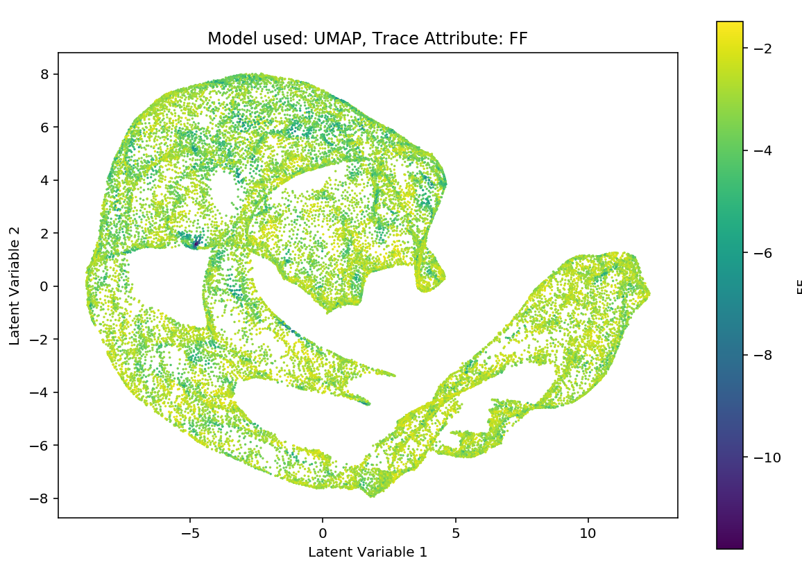

# SEISMIC REDUCTION 
## Unsupervised Machine Learning: An Application to Seismic Amplitude vs Offset Interpretation ##

This project delivers a set of tools to run unsupervised machine learning on seismic data sets. The aim is to enable the  efficient experimentation of an array of models and the range of paramaters therein. Specifically the tools allow for efficient recognition of clustering of low fluid-factor anomalies derived from AVO analysis.

---

## Getting started:

### Installation:
- The package is hosted at https://pypi.org/project/SeismicReduction/
- Install with the following in terminal:
```bash
pip install SeismicReduction
```
- The raw package tools are now available in any python script or jupyter notebook using standard import:
```python
import SeismicReduction
```

### Example data:
* The example data set used in the project can be acquired from this link:<br>
[Example dataset[zip, 205mb]](http://pangea.stanford.edu/departments/geophysics/dropbox/SRB/public/data/qsiProject_data.zip) *- curteousy of Stanford University*
- Only the following files need to be extracted:
> '3d_farstack.sgy', '3d_nearstack.sgy', 'Top_Heimdal_sebset.txt'


### Usage:
There are two ways to utilise the software, each with different merits:
1. **Direct Python Scripting:** Access the python package tools directly.
    * Access to model load/save capabilities for key models, or models run for large number of epochs.
    * Ability to nest runs in a list to efficiently explore a regular step of parameters.
    * Ability to save the scripts of particularly useful analysis
    * Ability to utilise distributed computing for large jobs without dependance on a notebook.
    
2. **Jupyter Notebook GUI:** Interface with very a straighforward self-explanatory graphical interface.
    * Easy access to analysis without need of coding experience.
    * Quick and easy to run an analysis with a few button clicks without having to write code.
    * Pickle checkpointing allows for quick runs without having to repeat costly dataloading (similar benefits with Jupyter cells)
  
---

## 1. Direct python scripting:

The tool is delivered via a series of classes delivering the following workflow:
1. Package import
2. Data Loading
3. Data Processing
4. Model Analysis
  1. Model embedding to a chosen dimension *Example: PCA, VAE..*
  2. Umap embedding to two dimensions
5. Visualisation
  1. Choice of attribute (colour scale) overlay *Example: fluid factor, horizon depth*


## Work Flow:

### 1.1 Importing
* Run via standard python import protocol. Can also choose to import individual classes but there isn't many so the namespace will not be cluttered.
```python
from SeismicReduction import *
```
### 1.2 Data loading
* Use class **DataHolder**. <br>
1. Initialisation:
    * Parameters:
       1. Dataset name : self explanatory
       2. inline range : in the form [start, stop, step]
       3. inline range : in the form [start, stop, step] <br>
*(if using test dataset use the below ranges, if using new data check the info documentation for this)*
```python
# init
dataholder = DataHolder("Glitne", [1300, 1502, 2], [1500, 2002, 2])
```
2. Loading the near and far offset amplitudes **.add_near(), .add_far()**:.
    * Parameter:
        1. Relative file pathnames <br>
* *files **must** be in .sgy format*
```python
# add near and far offset amplitudes
dataholder.add_near('./data/3d_nearstack.sgy');
dataholder.add_far('./data/3d_farstack.sgy');
```
3. Loading the horizon **.add_horizon()**:
    * Parameter:
        1. Relative file pathname
**Note:** file format must be .txt with columns: inline, crossline, twt
```python
# add the horizon depth
dataholder.add_horizon('./data/Top_Heimdal_subset.txt')
```
### 1.3 Data processing
* Use class **Processor**. 
1. Initialisation:
    * Initialise **once** per dataset
    * Parameter:
        1. DataHolder object. <br>
```python
# Create a processor object for the data
processor = Processor(dataholder)
```
2. Input generation via __\_\_call\_\___  method:
    * Parameters:
       1. flatten : three element list with three elements [bool, int: above add, int: below add]
           * [0] : Bool whether to run horizon flattening in the dataset
           * [1] : Above add choose number of above horizon amplitdue samples
           * [2] : Below add choose number of below horizon amplitdue samples
       2. crop : three element list with three elements [bool, int: above index, int: below index]
           * [0] :  Bool chooses whether to run cropping on the dataset
           * [1] :  Above index top extend of the seismic window to be cropped
           * [2] :  Below index bottom extend of the seismic window to be cropped
       3. normalise : bool
           * chooses whether to normalise the data or not
* **Note:** If both flattening and cropping are true, only flattening will occur. 
```python
# Generate an output, first param specifies flattening procedure, second specifies normalisation
input = processor(flatten=[True, 12, 52], crop=[False, 0, 0], normalise=True)
input2 = processor(flatten=[False, 0, 0], crop=[True, 10, 232], normalise=True)
```
### 1.4 Model analysis
* The available unsuperverised machine learning techniques are available in the following classes:
    1. Principal Component Analysis: **PcaModel**
    2. Uniform Manifold Approximation: **UmapModel**
    3. Variational Auto Encoder: **VaeModel**
    4. Beta-Varational Auto Encoder: **BVaeModel**

* Every model follows the exact same steps with variation to the .reduce() parameters dependant on specific model. 

1. Intialisation:
    * Parameter:
        1. Data input generated on the processor.__call__()
```python
# initialise a VAE model on the input
pca = PcaModel(input)
umap = UmapModel(input)
vae = VaeModel(input)
bvae = BVaeModel(input)

```

2. Perform model analysis/training/dimensionality reduction via **.reduce()** method:
    * **PcaModel**
        * Parameters:
            1. n_components : *number of prinicpal components for pca to reduce to*
    * **UmapModel**
        * Parameters:
            1. None : *method used to prepare object for umap algorithm in .to_2d() see later...*
    * **VaeModel**
        * Parameters:
            1. epochs : *number of epochs to train model on*
            2. hidden_size : *dimension used in latent space*
            3. lr : *learning rate for model training*
            4. recon_loss_method : *loss function used for reconstruction loss in ELBO*
            5. plot_loss : *bool to control live loss plotting functionality*
    * **BVaeModel**
        * Parameters:
            1. epochs : *number of epochs to train model on*
            2. hidden_size : *dimension used in latent space*
            3. lr : *learning rate for model training*
            4. beta : *beta parameter in the b-vae model training*
            5. recon_loss_method : *loss function used for reconstruction loss in ELBO*
            6. plot_loss : *bool to control live loss plotting functionality*
        
```python
# reduce to lower dimension
pca.reduce(n_components=3)
umap.reduce()
vae.reduce(epochs=10, hidden_size=2, lr=0.01, recon_loss_method='mse', plot_loss=True)
bvae.reduce(epochs=10, hidden_size=2, lr=0.01, beta=5, recon_loss_method='mse', plot_loss=True)
```

### 1.4.2 Two dimension UMAP embedding
* Regardless of the model, after **.reduce()**, **.to_2d()** must be run to convert to a 2d representation of the embedding via umap. <br>
**Note:** If already reduced to two dimensions via the model this method must still be run to configure internal data structures.
* **.to_2d()**:
   * Parameters:
      1. umap_neighbours : the n_neighbours parameter used by the umap algorithm
      2. umap_dist : the min_dist parameter used by the umap algorithm
      3. verbose : bool, print umap verbose training output, defualt=False
```python
# reduce to 2d with umap
pca.to_2d(umap_neighbours=50, umap_dist=0.02, verbose=True)
umap.to_2d(umap_neighbours=50, umap_dist=0.02)
vae.to_2d(umap_neighbours=50, umap_dist=0.02)
bvae.to_2d(umap_neighbours=50, umap_dist=0.02)
```

### 1.5 Visualisation
* Visualisation is run by a standalone function **PlotAgent()**:

* Parameters
    1. model : a model object initialised, embedded, and converted to 2d
    2. attr : to plot fluid factor use "FF", for horizon depth use "horizon"
    
```python
# Plot the vae representation with the AVO fluid factor attribute overlain
PlotAgent(model=pca, attr="FF")
PlotAgent(model=umap, attr="horizon")
PlotAgent(model=vae, attr="FF")
PlotAgent(model=bvae, attr="horizon")
```
### Output!


---

### Model Load and save functionality
* Load and save functionality is restricted to the vae and bvae models only.

1. Save trained network via **.save_nn()**:
    * Method on a model that has been trained via .reduce()
    * Parameter:
       1. File pathname string for model to be saved to
```python
vae.save_nn('./saved_nn/vae1')
````
2. Initialise new model object to host loaded model:
```python
loadedmodel = VaeModel(input1)
```

3. load trained network via **load_nn()**:
    * Parameter:
       1. File pathname string for model to be loaded
```python
loadedmodel.load_nn('./saved_nn/vae1')
```

4. Run **.reduce()** and **.to_2d()** as usual, the neural net will not need to be trained.
    * **Note:** no parameters taken in this call on **.reduce()** as the model is already trained!.
```python
loadedmodel.reduce()
loadedmodel.to_2d(umap_neighbours=5, umap_dist=0.1)
PlotAgent(loadedmodel)
```
---

## 2. Notebook GUI:
A jupyter notebook GUI that captures all of the tools functionality without need to edit code has been created and is available for download from this repo *'GUI_tool.ipynb'*.

The tool is delivered via jupyter widgets and follows the same workflow as the api tools:
- Data Loading->Data processing->Model analysis->Visualisation.

Via the use of pickling (the python module that allows for saving and loading of python objects) the analysis can be run in a segmented fashion. For example it is only necessary to load the data once, this can then be processed in a number of ways and in turn a number of different models can be run on one set of processed data.

---

### Documentation
- Detailed documentation of all python functions and classess.

## Testing
Continuous integration is deployed using the travis framework.

### Build Status
[](https://travis-ci.com/msc-acse/acse-9-independent-research-project-coush001)

### Integration testing
Integration testing involves running an anaylis using the current state of software and compares the final output against a documented and verified base case result. These tests ensure the full analysis pipeline is working as expected and is creating the expected outputs. Due to the stochastic nature of the algorithms, these are standardised with random seed setting.

Currently integration tests have to be run locally as there are some undiagnosed errors that appear when run with travis.

### Unit testing
Unit testing is employed to ensure the functions and methods of the software are delivering the expected outputs.
These are particularly focussed on running checks on the shapes of inputs and outputs from the functions and methods to ensure the expected data is being generated in the correct way.

---

## Built with:
python 3

## License
[MIT license](LICENSE)
